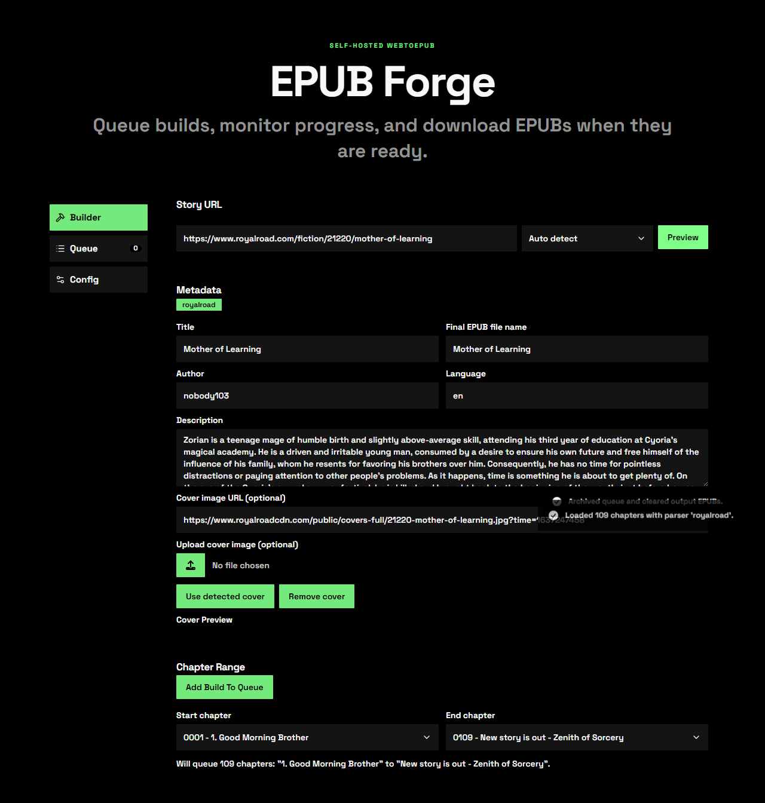
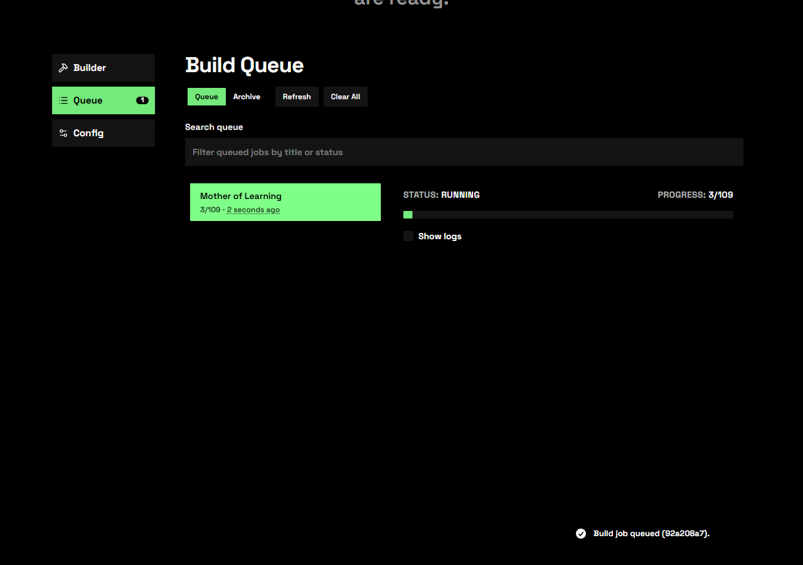
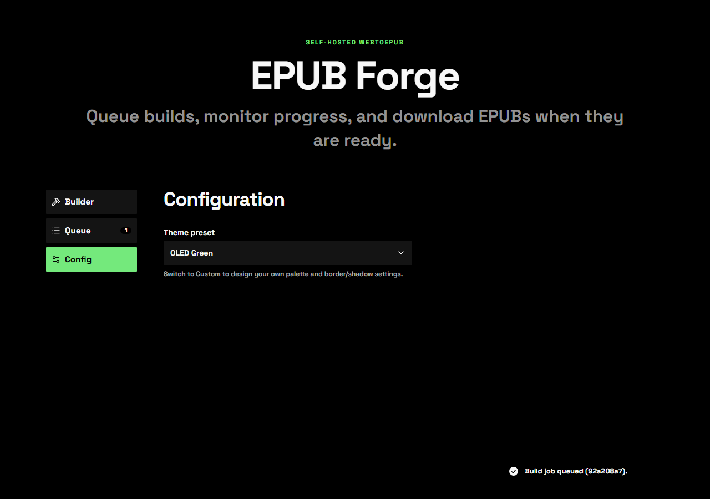

# epub-forge

Self-hosted web app for downloading web fiction as EPUB files.



## Supported sites

- `royalroad.com`
- `novelfire.net`
- `wanderinginn.com`
- Generic WordPress-style sites
- Any site with a sequential "next chapter" link pattern

<details>
<summary>More screenshots</summary>

**Build Queue**



**Configuration**



</details>

## Acknowledgements

Inspired by [WebToEpub](https://github.com/dteviot/WebToEpub) by dteviot.

## Prerequisites

- Node.js 20+

## Run locally (dev)

```bash
npm install
npm run dev
```

Opens at `http://localhost:3000` — API and UI served from one port with hot reload.

To use a different port:

```bash
npm run dev -- --port 4317
```

## Run locally (production build)

```bash
npm install
npm run build
npm start
```

Opens at `http://localhost:3000`.

## Run with Docker

```bash
docker compose up --build
```

Opens at `http://localhost:3000`.

### Persistent storage

Built EPUBs and queue state are stored on disk. Default paths (override via env vars):

| Env var | Default (local) | Default (Docker) | Purpose |
|---|---|---|---|
| `EPUB_OUTPUT_DIR` | `.data/epubs` | `/data/epubs` | Built EPUB files |
| `BOOKDROP_DIR` | `.data/bookdrop` | `/data/bookdrop` | Move-to-bookdrop destination |
| `CONFIG_DIR` | `.data/config` | `/data/config` | SQLite job queue (`jobs.db`) |

Example Docker Compose with volume mounts:

```yaml
services:
  epub-forge:
    image: ghcr.io/audemed44/epub-forge:latest
    restart: unless-stopped
    ports:
      - "9780:3000"
    environment:
      EPUB_OUTPUT_DIR: /data/epubs
      BOOKDROP_DIR: /data/bookdrop
      CONFIG_DIR: /data/config
    volumes:
      - /your/path/bookdrop:/data/bookdrop
      - /your/path/epubs:/data/epubs
      - /your/path/config:/data/config
```
